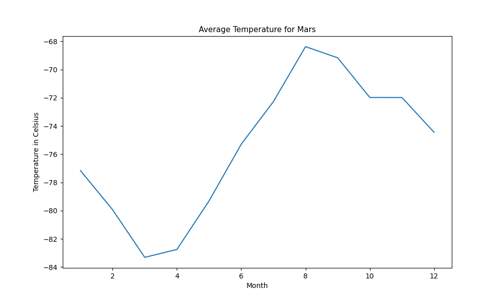
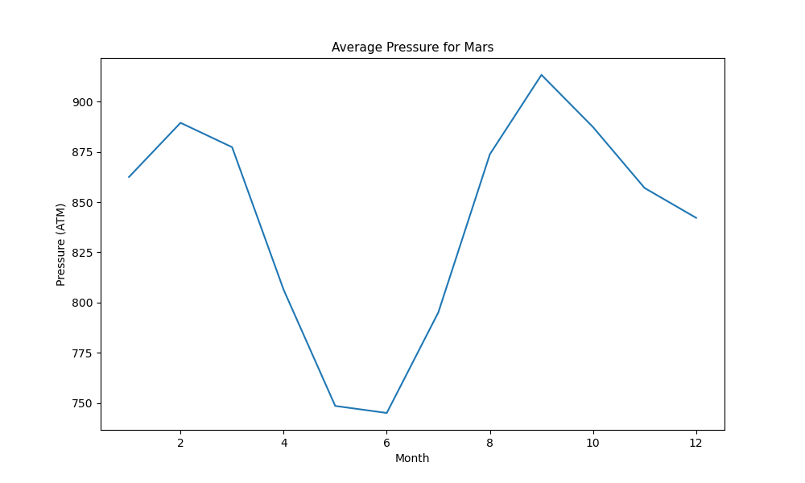

# data-collection
## Challenge #11

---

**This repository contains the following:**

Tha main folder with the Readme file and where Part I (part_1_mars_news.ipynb) and Part II (part_2_mars_weather.ipynb) of the analysis can be found here.

 A subfolder called  <mark>Output</mark>  where you will find the results and graphs for the challenge.

* The files Mars_table.csv, Temperature_table.csv and Pressure_table.csv can be found here.

---
---
## News in Mars
We scraped the link 'https://static.bc-edx.com/data/web/mars_news/index.html' and found a list of News about it. 

Here is a screenshot of the findings:

we also stored this news in a list of dictionaries, of which you can found a substring here:

## Weather in Mars

We created and saved a Dataframe for the Mars data extracted. With it we solve the folloing questions:

1. Based in the data provided Mars has 12 martian months.

2. The Curiosity has been in Mars 1977 martian days, gathering data. 

3. The average temperature for Mars is:

|Month|Avg Temperature(C)|
|------|------|
|1	|-77.16|
|2	|-79.93|
|3	|-83.31|
|4	|-82.75|
|5	|-79.31|
|6	|-75.30|
|7	|-72.28|
|8	|-68.38|
|9	|-69.17|
|10	|-71.98|
|11	|-71.99|
|12	|-74.45|

The coldest month is number 3 with an average temperature of -83.31
The warmest month is number 8 with an average temperature of -68.38
A graph with the results is presented below:

4.The average pressure per month is:

|Month|Avg Pressure|
|------|------|
|1     |862.49|
|2     |889.46|
|3     |877.32|
|4     |806.33|
|5     |748.56|
|6     |745.05|
|7     |795.11|
|8     |873.83|
|9     |913.31|
|10    |887.31|
|11    |857.01|
|12    |842.16|

The month with the minimum pressure is number 6 with an average pressure of 745.05
The month with the maximum pressure is number 9 with an average pressure of 913.31

Here is a graph with the results:

5.The database used had data from 2012-08-16 to 2018-02-27.

We also obtained the position of Mars towards the sun: as a year is the time the planet takes to do a full lap around the sun we we can base the calculation in the angle of Mars towards the sun. We know a planet have to walk all the 360 grades from its initial position, so we extracted the minimum dates when the angle towards the sun was 0 and 359. Substracting the results we calculated Mars just did 2 laps and began another, with each lap lasting for 687 days each. Thus:

A Martian year lasts 687 days or 1.88 terrestrial years. 
